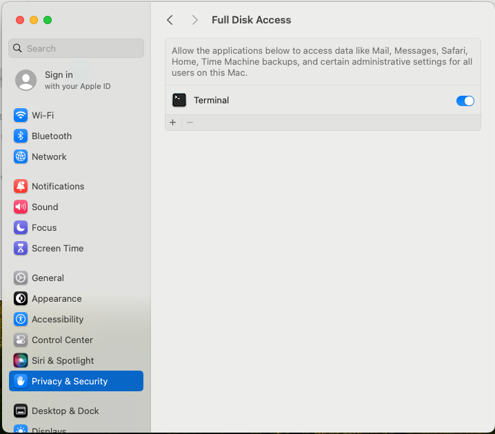

# Cidre-VM


Cidre-VM is software installation scripts for macOS systems that allows you to setup a Virtual Machine (VM) for reverse engineering macOS malware samples. Essentially, Cidre-VM serves as the macOS counterpart to [FLARE-VM](https://github.com/mandiant/flare-vm). It streamlines the process of installing essential software for macOS malware analysis by utilizing Homebrew and Homebrew Cask.

## Requirements

Cidre-VM should be installed on a virtual machine. The virtual machine must meet the following requirements:

- Operating System: macOS Ventura or later
- Network: An active Internet connection
- Storage: A minimum disk capacity of 30GiB
- Memory: At least 8GiB of RAM

## Installation instruction

Prior to executing the installation script, it is imperative to grant Full Disk Access (FDA) permission to Terminal.app. This step is crucial for allowing the script to perform necessary operations without prompting.



Once Full Disk Access has been configured, proceed by opening Terminal.app and executing the install.sh script as follows:

```
chmod +x install.sh
sudo ./install.sh
```

## Customization

Cidre-VM offers flexible customization options to cater to various analysis needs. Software that is compatible with Homebrew can be easily added or removed by modifying the [Brewfile](./Brewfile). For software that is not available through Homebrew, custom installation scripts can be added to the [custom](./custom/) directory, thus expanding the VM's capabilities to include additional tools and applications.

## Author

Koh M. Nakagawa (@tsunek0h)

## License

Cidre-VM is licensed under the [Apache License, Version 2.0](./LICENSE)
